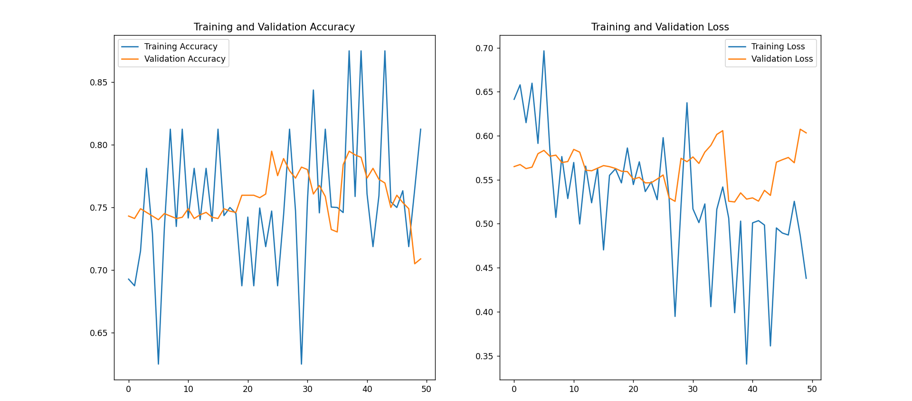
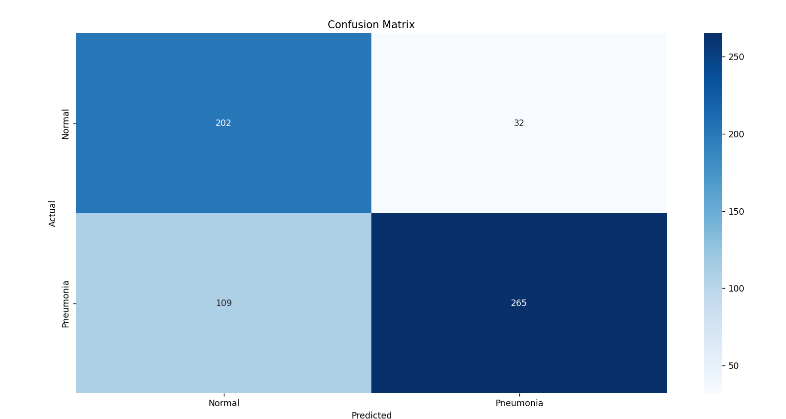
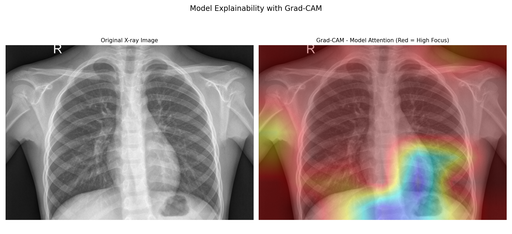

# Medical AI: Pneumonia Detection from Chest X-ray Images

Deep learning project using ResNet50 transfer learning to classify chest X-ray images as Normal or Pneumonia.

## Features
- Pre-trained ResNet50 (ImageNet weights)
- Data Augmentation for better generalization
- Grad-CAM visualizations for explainable AI
- High test accuracy with clear results

## Dataset
Kaggle Chest X-ray Pneumonia dataset: https://www.kaggle.com/datasets/paultimothymooney/chest-xray-pneumonia

## Results

**Training and Validation Curves**  

**Confusion Matrix**  

**Grad-CAM Visualizations**  
  

## How to Run
1. Download the dataset and place in a folder named 'chest_xray'
2. Run the script: `python pneumonia_detection.py`

Trained model available upon request.

## About the Author
- Computer Science student at University of Tehran
- 3rd place winner in a startup competition
- Specialized in Medical AI, Computer Vision, and Deep Learning
